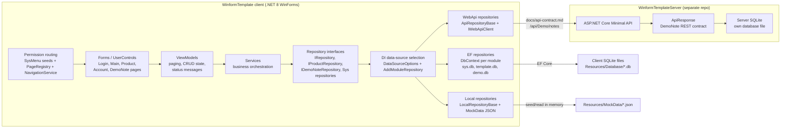

# Architecture

本文描述当前实际实现。若旧文档与本文冲突，以 [docs/项目架构与文件结构.md](docs/项目架构与文件结构.md) 和 [docs/api-contract.md](docs/api-contract.md) 为准。

## Overall Shape

客户端是 .NET 8 WinForms + AntdUI 应用。业务调用链保持单向：

```text
UI(UserControl/Form)
  -> ViewModel
  -> Service
  -> IXxxRepository
  -> Ef / WebApi / Local repository
```

硬性边界：

- UI 只处理控件、布局和交互，不直接访问 `DbContext`、`HttpClient` 或仓储实现。
- ViewModel 只编排页面状态、命令、分页、CRUD 调用和降级提示，不引用 EF、HTTP 或 `Expression<Func<...>>`。
- Service 只依赖仓储接口，查询条件必须下推给 Repository。
- Repository 实现负责具体数据源细节。EF 写 LINQ/SQLite，WebApi 写 REST 映射，Local 写 JSON-backed 内存集合。

## Architecture Diagram



## Startup And DI

入口在 [WinformTemplate/Program.cs](WinformTemplate/Program.cs)。启动顺序：

1. 初始化 WinForms、AntdUI 和 log4net。
2. 读取 `WinformTemplate/Resources/Config/config.json`；缺失时由 `config.example.json` 复制。
3. [AppServiceRegistration](WinformTemplate/Src/Bootstrap/AppServiceRegistration.cs) 注册配置、DbContext、仓储、服务、ViewModel、页面和导航。
4. `InitializeDatabaseAsync` 执行所有 `IDatabaseInitializer`，创建 EF 库并写入种子。
5. 解析 `LoginForm`，登录成功后进入 `MainForm`。

`DataSourceOptions` 来自 `ProjectConfig.DataSource`。`AddModuleRepository<TInterface, TEf, TApi, TLocal>(moduleKey)` 根据模块配置解析仓储实现。当前可配置模块：

| Module | Runtime switch | Main repositories |
| --- | --- | --- |
| `Sys` | `DataSource.Modules.Sys` | account/menu/role/param/role-auth repositories |
| `Template` | `DataSource.Modules.Template` | product/category/import-record repositories |
| `Demo` | DemoNote 三页固定注入具体实现，不走模块切换 | `EfDemoNoteRepository` / `ApiDemoNoteRepository` / `LocalDemoNoteRepository` |

## Data Sources

### EF

EF Core 直接访问客户端本地数据库。SQLite 路径由 [EfDbContextOptions](WinformTemplate/Src/Common/DataAccess/EfDbContextOptions.cs) 解析：

| Module | DbContext | Registration | Default file |
| --- | --- | --- | --- |
| `Sys` | `SysDbContext` | `SysDbContextService.AddSysDatabase` | `Resources/Database/sys.db` |
| `Template` | `TemplateDbContext` | `TemplateDbContextService.AddTemplateDatabase` | `Resources/Database/template.db` |
| `Demo` | `DemoDbContext` | `DemoDbContextService.AddDemoDatabase` | `Resources/Database/demo.db` |

每个 EF 模块使用独立 SQLite 文件。原因是项目保留 `EnsureCreated + 自动种子` 的开箱体验，而 EF Core `EnsureCreated` 不支持多个 `DbContext` 可靠共用同一个库：第一个 Context 创建库后，后续 Context 会认为库已存在而跳过建表，最终导致缺表。启动集成测试 [AppStartupIntegrationTests](WinformTemplate.Tests/Startup/AppStartupIntegrationTests.cs) 会验证 `sys.db`、`template.db`、`demo.db` 都在真实启动序列中创建并可查询。

### WebApi

WebApi 仓储继承 [ApiRepositoryBase](WinformTemplate/Src/Common/DataAccess/ApiRepositoryBase.cs)，通过 `IWebApiClient` 调用 REST。唯一契约来源是 [docs/api-contract.md](docs/api-contract.md)。传输不可达时，`ApiRepositoryBase` 把 `ApiResponse<T>.isTransportError=true` 转成 `DataSourceUnavailableException`，由 ViewModel 显示降级状态。

独立后端位于：

```text
../WinformTemplateServer
```

后端是独立 git 仓库、独立 solution、.NET 8 ASP.NET Core Minimal API + EF Core + SQLite。默认监听：

- `https://localhost:5001`
- `http://localhost:5000`

客户端默认 `WebApi.BaseUrl` 对齐 `https://localhost:5001`。开发期 Swagger 位于 `/swagger`。

### Local

Local 仓储继承 [LocalRepositoryBase](WinformTemplate/Src/Common/DataAccess/LocalRepositoryBase.cs)，读取 `WinformTemplate/Resources/MockData/*.json`。CRUD 只修改进程内集合，不回写磁盘，便于演示数据重置。测试如需修改 Local 数据，应使用临时 seed root，避免静态缓存污染。

## DemoNote Phase II Example

Demo 模块使用同一个实体 [DemoNote](WinformTemplate/Src/Business/Demo/Model/DemoNote.cs)，字段与 `docs/api-contract.md` 一致：`Id`、`Title`、`Content`、`Pinned`、`CreateAt`、`UpdateAt`。

仓储契约：

- [IDemoNoteRepository](WinformTemplate/Src/Business/Demo/Repositories/IDemoNoteRepository.cs)
- [EfDemoNoteRepository](WinformTemplate/Src/Business/Demo/Repositories/EfCore/EfDemoNoteRepository.cs)
- [ApiDemoNoteRepository](WinformTemplate/Src/Business/Demo/Repositories/WebApi/ApiDemoNoteRepository.cs)
- [LocalDemoNoteRepository](WinformTemplate/Src/Business/Demo/Repositories/Local/LocalDemoNoteRepository.cs)

三页 UI 都继承 [DemoNoteControlBase](WinformTemplate/UI/Business/Demo/DemoNoteControlBase.cs)，每页固定绑定一种数据源，页面展示“当前数据源：EF / WebAPI / Local”：

| Menu key | Page | Repository |
| --- | --- | --- |
| `/demo/note-ef` | `EfDemoNoteControl` | `EfDemoNoteRepository` |
| `/demo/note-api` | `ApiDemoNoteControl` | `ApiDemoNoteRepository` |
| `/demo/note-local` | `LocalDemoNoteControl` | `LocalDemoNoteRepository` |

WebAPI 页在后端关闭时不崩溃，ViewModel 捕获 `DataSourceUnavailableException` 并显示未连接后端语义；EF 和 Local 页不依赖后端。

## Navigation And Permissions

导航实现位于 [WinformTemplate/Src/Navigation](WinformTemplate/Src/Navigation)：

- `PageRegistryDefaultPages` 注册 menuKey 到页面工厂。
- `NavigationService` 在解析页面前再次检查当前账号权限。
- `CurrentAccountAccessor` 保存当前登录账号。

菜单 key 必须三处一致：

1. EF 种子：[SysDatabaseInitializer](WinformTemplate/Src/Business/Sys/Context/Full/SysDatabaseInitializer.cs)
2. Local 种子：[sysMenus.json](WinformTemplate/Resources/MockData/sysMenus.json) 和 [sysRoleAuths.json](WinformTemplate/Resources/MockData/sysRoleAuths.json)
3. 页面注册：[PageRegistryDefaultPages](WinformTemplate/Src/Navigation/PageRegistryDefaultPages.cs)

守卫测试 `SysMenuSeedUrls_AreConsistentAcrossEfLocalAndRegisteredPages` 会核对这三处。默认 `admin / 123456` 授权账户、角色、Product 和三个 Demo 页；`operator / 123456` 只授权账户页。

## Security

密码通过 [PasswordHasher](WinformTemplate/Src/Tools/Encryption/PasswordHasher.cs) 使用 PBKDF2 加盐哈希。`SysAccountService` 登录时会校验 PBKDF2，并按配置升级旧哈希。真实环境必须修改演示账号密码，真实 `config.json` 不入库。

## UI Construction Rule

PageRegistry 注册页由点击菜单时才构造，此时控件通常还没有真实尺寸。页面构造期不得设置依赖实际宽高的 `SplitterDistance` 或大 `Panel1MinSize/Panel2MinSize`。账户页的 `SplitContainer` 在构造期只设置安全小值，真实分栏约束在 `HandleCreated/Load/SizeChanged` 后由 `EnsureSplitDistance` 设置。

构造冒烟测试 [PageConstructionSmokeTests](WinformTemplate.Tests/Navigation/PageConstructionSmokeTests.cs) 使用真实 DI 容器，在 STA 线程逐个构造所有默认注册页，防止菜单点击时构造期崩溃。

## Required Tests

Phase II 后必须保持这些测试绿色：

- `SysMenuSeedUrls_AreConsistentAcrossEfLocalAndRegisteredPages`：菜单 seed 和页面注册一致。
- `AppStartupIntegrationTests`：真实 DI + 数据库初始化序列，覆盖 Sys、Template、Demo 独立 EF 库。
- `PageConstructionSmokeTests`：所有默认注册页能在 STA 线程构造。
- `ApiRepositoryTests`：REST 端点映射、`DataSourceUnavailableException`。
- `DemoNoteManagementViewModelTests` / `DemoNoteRepositoryTests`：DemoNote CRUD、分页、搜索、EF/Local 一致性。
- `ProductManagementViewModelTests` / `TemplateRepositoryDataSourceTests`：Product 示例链路和导出。

常用验证命令：

```powershell
dotnet build WinformTemplate.sln -warnaserror
dotnet test WinformTemplate.sln
dotnet list WinformTemplate.sln package --vulnerable --include-transitive
```
