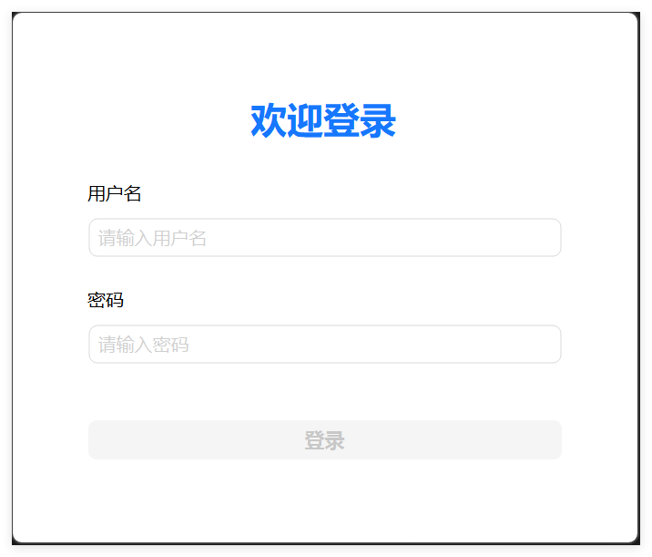
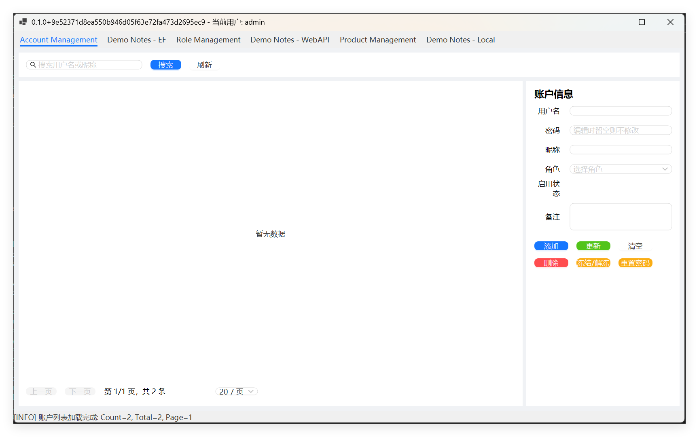
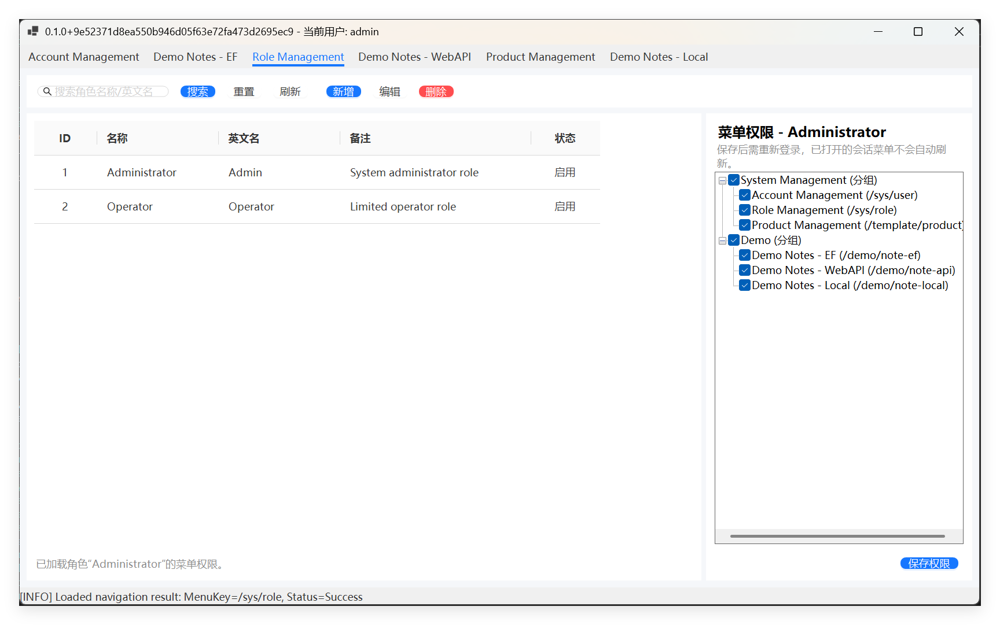
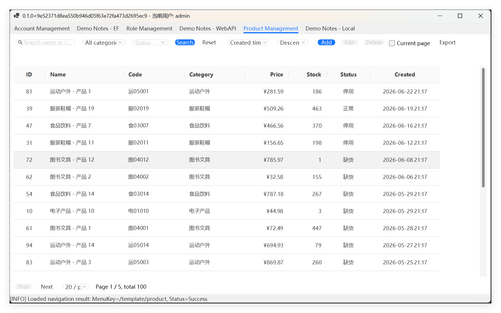
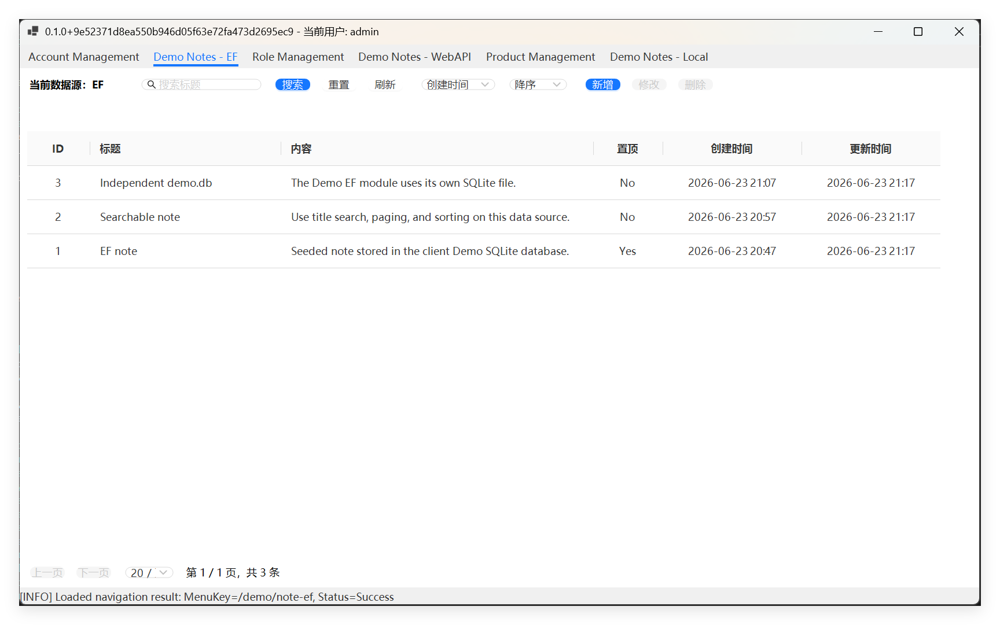
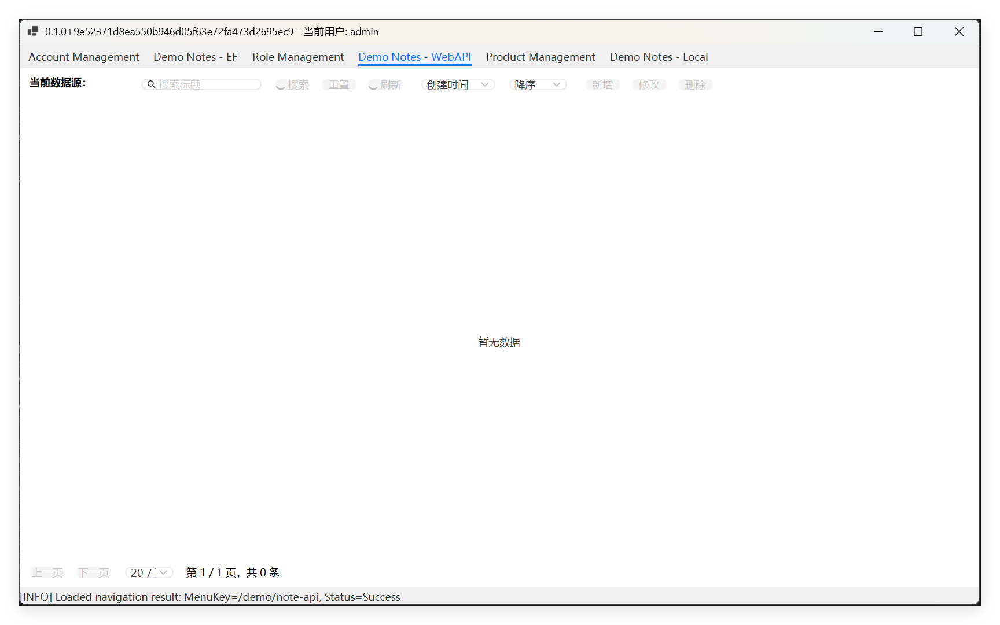
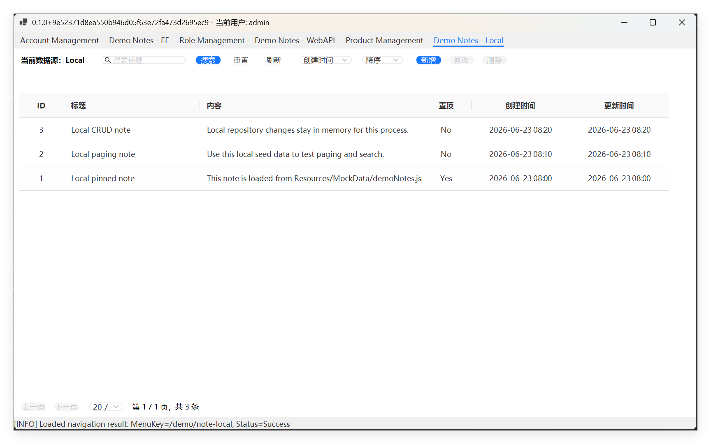

# WinformTemplate

WinformTemplate 是一个基于 .NET 8、WinForms、AntdUI 的桌面客户端模板。当前版本已经包含登录、角色权限、菜单导航、Product 业务样例、DemoNote 三数据源演示，以及可对接的独立 WebAPI 服务端。

项目目标是让二次开发从“拷贝样例模块并按规范扩展”开始，而不是每次重新搭建 WinForms、MVVM、仓储、权限和数据源切换基础设施。

## 项目截图

### 登录



### 账户与角色





### Product 管理样例



### DemoNote 三数据源演示







## 当前能力

- WinForms 桌面客户端，UI 使用 AntdUI。
- 自研轻量 MVVM：`ObservableObject`、`BaseViewModel`、`RelayCommand`、绑定扩展。
- `UI -> ViewModel -> Service -> Repository` 单向业务链路，UI 不直接访问数据库或 HTTP。
- Sys、Template 模块支持按配置切换 `Ef`、`WebApi`、`Local` 仓储实现。
- DemoNote 提供 EF、WebAPI、Local 三个固定页面，用同一套实体和 ViewModel 对照三种数据源。
- 默认 SQLite 首次运行自动建库和写入种子数据。
- 基于角色的菜单过滤和导航二次鉴权，菜单 key 使用 `SysMenu.SmUrl`。
- Product 样例覆盖分页、搜索、排序、增删改、批量操作、Excel 导出。
- WebAPI 失败和业务未命中分离：传输不可达抛 `DataSourceUnavailableException`，业务未命中返回空结果、`null` 或 `false`。

## 快速开始

环境要求：

- Windows
- .NET 8 SDK

客户端命令：

```powershell
dotnet restore
dotnet build WinformTemplate.sln -warnaserror
dotnet test WinformTemplate.sln
dotnet run --project WinformTemplate
```

首次运行时，程序会从 `WinformTemplate/Resources/Config/config.example.json` 复制生成本地 `config.json`。真实 `config.json` 不入库，数据库密码、服务地址等本地配置只保存在本机。

## 演示账号

| 账号 | 密码 | 默认权限 |
| --- | --- | --- |
| `admin` | `123456` | 账户、角色、Product、DemoNote EF/WebAPI/Local |
| `operator` | `123456` | 账户管理 |

生产环境必须修改默认密码。密码使用 PBKDF2 加盐哈希，配置项 `Security.UpgradeLegacyPasswordHashOnLogin` 用于兼容并迁移旧哈希。

## 数据源配置

配置文件位于 `WinformTemplate/Resources/Config/config.json`：

```json
{
  "DataSource": {
    "Default": "Ef",
    "Modules": {
      "Sys": "Ef",
      "Template": "Ef",
      "Demo": "Ef"
    }
  },
  "Ef": {
    "DbType": "SQLite",
    "SQLitePath": "./Resources/Database",
    "MySqlConnection": "server=127.0.0.1;port=3306;user=root;database=base;password=__SET_ME__;"
  },
  "WebApi": {
    "BaseUrl": "https://localhost:5001",
    "TimeoutSeconds": 30
  },
  "Local": {
    "SeedPath": "./Resources/MockData"
  },
  "Security": {
    "UpgradeLegacyPasswordHashOnLogin": true
  }
}
```

`Sys` 和 `Template` 通过 `AddModuleRepository` 按模块切换仓储实现：

- `Ef`：EF Core 直连本地数据库，默认 SQLite，也保留 MySQL 配置入口。
- `WebApi`：按 `docs/api-contract.md` 调用 REST 服务。
- `Local`：从 `Resources/MockData/*.json` 读取种子数据，CRUD 只在进程内生效。

DemoNote 是教学对照模块，三个页面固定绑定三种仓储：

| 菜单 key | 页面 | 数据源 |
| --- | --- | --- |
| `/demo/note-ef` | `EfDemoNoteControl` | 客户端 SQLite |
| `/demo/note-api` | `ApiDemoNoteControl` | `WinformTemplateServer` |
| `/demo/note-local` | `LocalDemoNoteControl` | 本地 MockData 内存集合 |

## SQLite 分库

默认 SQLite 下，每个 EF 模块使用独立数据库文件：

- Sys：`Resources/Database/sys.db`
- Template：`Resources/Database/template.db`
- Demo：`Resources/Database/demo.db`

这样可以继续使用 `EnsureCreated + 自动种子` 的开箱体验，避免多个 `DbContext` 共用同一个 SQLite 文件时漏建表。若二开项目必须使用单一数据库文件，应改为 EF Migrations 统一建表。

## WebAPI 服务端

服务端位于相邻仓库：

```text
D:\Work\Code\CSharp\WinformTemplateServer
```

它是独立 .NET 8 ASP.NET Core Minimal API 服务，当前实现 DemoNote CRUD、分页、搜索和排序，默认地址：

- `https://localhost:5001`
- `http://localhost:5000`

客户端 `WebApi.BaseUrl` 默认指向 `https://localhost:5001`。启动服务端后，客户端的 DemoNote WebAPI 页面即可访问真实后端 SQLite 数据库。

## 主要目录

```text
WinformTemplate/
  Program.cs
  MainForm.cs
  Resources/
    Config/config.example.json
    MockData/*.json
  Src/
    Bootstrap/AppServiceRegistration.cs
    Common/DataAccess/
    Common/MVVM/
    Business/Sys/
    Business/Template/
    Business/Demo/
    Navigation/
    FIO/Excel/
  UI/
    Business/Sys/
    Business/Template/Product/
    Business/Demo/
WinformTemplate.Tests/
  Business/
  Common/
  Navigation/
  Startup/
docs/
  api-contract.md
  二开指南.md
  项目架构与文件结构.md
  局部skill评估.md
```

## 二开入口

新增常规业务模块优先对照 Product：

- Model：`Src/Business/Template/Model/ProductModel.cs`
- Repository 契约：`Src/Business/Template/Repositories/IProductRepository.cs`
- 三种仓储实现：`Repositories/EfCore/`、`Repositories/WebApi/`、`Repositories/Local/`
- Service：`Src/Business/Template/Service/ProductService.cs`
- ViewModel：`Src/Business/Template/ViewModel/ProductManagementViewModel.cs`
- UI：`UI/Business/Template/Product/ProductManagementControl.cs`
- DI 注册：`Src/Bootstrap/AppServiceRegistration.cs`
- 菜单与页面注册：`Src/Navigation/PageRegistryDefaultPages.cs`

想对照三种数据源差异时看 DemoNote；想做真实业务模块时看 Product。

## 文档

- [docs/项目架构与文件结构.md](docs/项目架构与文件结构.md)：当前架构、调用链、文件结构和变更入口。
- [docs/二开指南.md](docs/二开指南.md)：按现有模式新增业务模块的步骤。
- [docs/api-contract.md](docs/api-contract.md)：客户端和服务端共用的 REST 契约。
- [docs/局部skill评估.md](docs/局部skill评估.md)：是否适合制作项目局部 skill 的评估和建议。
- [ARCHITECTURE.md](ARCHITECTURE.md)：Phase II 架构细节和守卫测试说明。

## 测试

关键测试覆盖：

- `NavigationPermissionTests`：权限菜单、页面 key、EF/Local 菜单种子一致性。
- `PageConstructionSmokeTests`：所有默认注册页面可在真实 DI 下构造。
- `AppStartupIntegrationTests`：真实启动序列、数据库初始化、登录和 Product 查询。
- `TemplateRepositoryDataSourceTests`：Product EF/Local 仓储契约一致。
- `ProductManagementViewModelTests`：Product 分页、CRUD 和导出逻辑。
- `DemoNoteRepositoryTests` / `DemoNoteManagementViewModelTests`：DemoNote 三数据源样例。
- `ApiRepositoryTests`：REST URL 映射和传输失败处理。

常用验证命令：

```powershell
dotnet build WinformTemplate.sln -warnaserror
dotnet test WinformTemplate.sln
dotnet list WinformTemplate.sln package --vulnerable --include-transitive
```

## 已知限制

- UI 已能覆盖主要演示流程，但小屏和复杂分辨率下的视觉细节仍可继续优化。
- SysRole、SysMenu、SysParam 仍是轻量管理入口，后续可参考 Product 页补强分页和批量能力。
- 当前服务端只实现 DemoNote 端点；Sys、Template WebAPI 端点已有契约和客户端仓储，但服务端尚未全部实现。

## 许可证

MIT。见 [LICENSE](LICENSE)。
