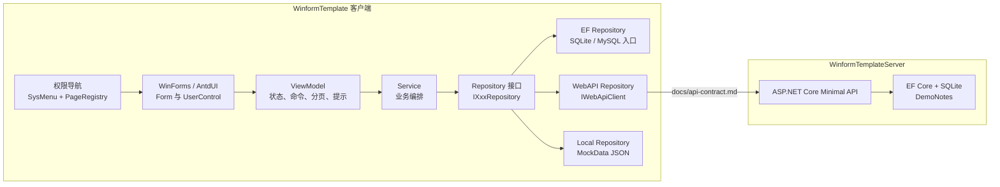

# 项目架构与文件结构

本文根据当前代码整理 WinformTemplate 客户端和相邻 WinformTemplateServer 服务端的实际架构、文件结构与二开入口。

## 总体架构



核心调用链是：

```text
UI(UserControl/Form)
  -> ViewModel
  -> Service
  -> IXxxRepository
  -> Ef / WebApi / Local repository
```

DemoNote 为了演示三种数据源，ViewModel 直接依赖 `IDemoNoteRepository`，并由 EF、WebAPI、Local 三个页面分别注入具体仓储。常规业务模块仍建议走 `UI -> ViewModel -> Service -> Repository`。

## 分层职责

| 层级 | 主要职责 | 约束 |
| --- | --- | --- |
| UI | 控件、布局、事件、弹窗、AntdUI 表格绑定 | 不直接访问 `DbContext`、`HttpClient`、仓储实现 |
| ViewModel | 页面状态、命令、分页、排序、CRUD 调用、错误提示 | 不引用 EF 类型，不暴露 `IQueryable` |
| Service | 业务编排、校验、跨仓储组合 | 只依赖仓储接口，查询条件下推 |
| Repository 接口 | 业务数据访问契约 | 不暴露 EF 表达式或 HTTP 细节 |
| EF Repository | LINQ 查询、分页、排序、SQLite/MySQL 持久化 | 每个模块使用独立 `DbContext` |
| WebAPI Repository | REST URL 映射、响应包络处理 | 传输失败必须转为 `DataSourceUnavailableException` |
| Local Repository | 读取 MockData JSON，进程内 CRUD | 不回写 JSON 文件 |
| Navigation | 菜单 key 注册、角色过滤、导航二次鉴权 | EF seed、Local seed、PageRegistry 必须一致 |

## 启动流程

1. `Program.Main` 初始化 WinForms、AntdUI 和 log4net。
2. `GlobalProjectConfig` 读取 `Resources/Config/config.json`，缺失时从 `config.example.json` 复制。
3. `AppServiceRegistration.BuildServiceProvider` 注册配置、数据源选项、DbContext、仓储、服务、ViewModel、页面和导航。
4. `InitializeDatabaseAsync` 执行所有 `IDatabaseInitializer`，创建 EF 数据库并写入种子。
5. 解析 `LoginForm`，登录成功后打开 `MainForm`。
6. `MainForm` 通过 `NavigationService` 根据菜单 key 加载页面。

## 数据源策略

`DataSourceOptions` 从配置读取默认数据源和模块数据源。`AddModuleRepository<TInterface, TEf, TApi, TLocal>(moduleKey)` 根据模块 key 选择运行时仓储。

当前状态：

| 模块 | 配置切换 | 数据库/数据源 |
| --- | --- | --- |
| Sys | 支持 `Ef` / `WebApi` / `Local` | `sys.db`、REST、`sys*.json` |
| Template | 支持 `Ef` / `WebApi` / `Local` | `template.db`、REST、`products.json` 等 |
| Demo | 三个页面固定演示三种仓储 | `demo.db`、WinformTemplateServer、`demoNotes.json` |

默认 SQLite 文件：

```text
WinformTemplate/Resources/Database/sys.db
WinformTemplate/Resources/Database/template.db
WinformTemplate/Resources/Database/demo.db
```

独立分库是为了保留 `EnsureCreated + 自动种子` 的简单启动模型。多个 `DbContext` 共用同一个 SQLite 文件时，后启动的 Context 可能因为数据库已存在而跳过建表。

## 客户端文件结构

```text
WinformTemplate/
  Program.cs                         # 应用入口、DI 初始化、登录后打开 MainForm
  MainForm.cs                        # 主窗体、菜单与内容区域
  Resources/
    Config/
      config.example.json            # 默认配置模板
    MockData/
      sysAccounts.json               # Local Sys 数据
      sysMenus.json
      sysRoleAuths.json
      products.json                  # Local Template 数据
      categories.json
      importRecords.json
      demoNotes.json                 # Local Demo 数据
    Log4net/
      log4net.config
  Src/
    Bootstrap/
      AppServiceRegistration.cs      # DI、仓储、服务、页面注册
    Common/
      DataAccess/                    # 仓储基类、数据源配置、WebApiClient
      MVVM/                          # ObservableObject、BaseViewModel、命令和绑定扩展
      Config/
    Business/
      Sys/                           # 账号、角色、菜单、权限、SysDbContext
      Template/                      # Product 样例、Category、ImportRecord
      Demo/                          # DemoNote 三数据源样例
    Navigation/                      # PageRegistry、NavigationService、当前账号上下文
    FIO/Excel/                       # Excel 导入导出辅助
    Tools/                           # 加密、文件、工具函数
    Logger/
  UI/
    Business/
      Sys/                           # Login、Account、Role 页面
      Template/Product/              # Product 管理 UI
      Demo/                          # DemoNote EF/WebAPI/Local 页面
    Activate/
    TestPage/
WinformTemplate.Tests/
  Startup/                           # 真实 DI + 数据库初始化测试
  Navigation/                        # 菜单 key、权限、页面构造测试
  Business/                          # Sys、Template、Demo ViewModel/Repository 测试
  Common/                            # WebAPI 仓储基础能力测试
docs/
  api-contract.md                    # REST 契约
  二开指南.md                        # 新增模块步骤
  项目架构与文件结构.md              # 本文
  局部skill评估.md                   # 项目局部 skill 评估
  img/                               # README 截图
```

## 服务端文件结构

```text
WinformTemplateServer/
  WinformTemplateServer.sln
  src/
    WinformTemplateServer/
      Program.cs                     # Minimal API、数据库初始化、端点实现
      appsettings.json               # 日志与数据库路径配置
      Contracts/
        ApiResponse.cs               # 响应包络
        PagedResult.cs               # 分页结构
      Data/
        DemoDbContext.cs             # DemoNote EF 模型配置
      Models/
        DemoNote.cs                  # 服务端实体
      Requests/
        DemoNoteRequest.cs           # 新增/修改 DTO
      Properties/
        launchSettings.json          # http/https 开发启动配置
  tests/
    WinformTemplateServer.Tests/
      DemoNoteEndpointsTests.cs      # 端点集成测试
```

## 常见改动入口

| 需求 | 优先修改位置 |
| --- | --- |
| 新增业务模块 | `Src/Business/{Module}`、`UI/Business/{Module}`、`AppServiceRegistration`、`PageRegistryDefaultPages` |
| 新增菜单 | `SysDatabaseInitializer`、`Resources/MockData/sysMenus.json`、`Resources/MockData/sysRoleAuths.json`、`PageRegistryDefaultPages` |
| 新增 EF 模块 | `{Module}DbContext`、`{Module}DbContextService`、`{Module}DatabaseInitializer`、EF Repository |
| 新增 WebAPI 端点 | `docs/api-contract.md`、客户端 `ApiXxxRepository`、服务端 Minimal API |
| 新增 Local 数据 | `Resources/MockData/*.json`、`LocalXxxRepository` |
| 修改 Product 页面 | `ProductManagementViewModel`、`ProductService`、`ProductManagementControl`、Product repositories |
| 修改 DemoNote 页面 | `DemoNoteManagementViewModel`、`DemoNoteControlBase`、三个具体控件和 repositories |
| 改登录/权限 | `SysAccountService`、`PermissionService`、`NavigationService`、Sys repositories |

## 必守规则

- 菜单 key 必须在 EF seed、Local seed、PageRegistry 三处一致。
- UI、ViewModel、Service 不直接依赖 EF、HTTP 或仓储实现。
- 查询、分页、排序、过滤必须下推到 Repository。
- WebAPI 传输不可达必须抛 `DataSourceUnavailableException`。
- 新 EF 模块要有独立数据库文件或迁移策略，不要随意把多个 Context 塞进同一个 SQLite 文件。
- 页面构造期不要依赖真实尺寸，避免点击菜单时构造崩溃。
- 新增模块后至少补对应 Repository/ViewModel 测试，并跑启动和导航守卫测试。

## 验证命令

客户端：

```powershell
dotnet build WinformTemplate.sln -warnaserror
dotnet test WinformTemplate.sln
```

服务端：

```powershell
cd D:\Work\Code\CSharp\WinformTemplateServer
dotnet build WinformTemplateServer.sln -warnaserror
dotnet test WinformTemplateServer.sln --no-build
```
